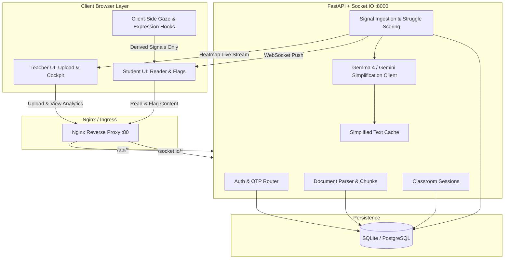

# 🏛️ ClariClass — Architectural Blueprint & Governance Plan

> **Role**: Master Planning Architect & Technical Governance  
> **Status**: Approved Blueprint & Structural Scaffold  
> **Target System**: Real-Time Adaptive Lecture Web Application with OTP Auth & Gemma AI

---

## 1. 🎓 Conceptual Masterclass: Philosophy, First Principles & Landscape

### 1.1 The Core Problem
In conventional lecture settings, student confusion is invisible and lagging. Instructors only discover widespread difficulty after failed quizzes or exams. Furthermore, struggling students often hesitate to interrupt live lectures. **ClariClass** flips this dynamic from passive lag to **active, sub-second edge adaptation**:
1. **Edge Telemetry Ingestion**: Passive dwell-time tracking, gaze tracking, facial expression inference, and active manual flags.
2. **Privacy-Preserving Edge Compute**: Zero raw webcam video or biometric imagery ever leaves the client device. Only quantized signal scores (e.g. `dwell_ms`, `flag_difficult`, `confusion_score: [0..1]`) are transmitted to the server.
3. **Threshold-Based Collective Triggering**: Rather than spamming AI calls per individual, the system evaluates classroom consensus (e.g. $\ge 25\%$ struggling). When the collective threshold is crossed, the system executes an idempotent AI simplification via **Gemma 4**.
4. **Targeted Live Delivery**: Simplified breakdowns are pushed over WebSockets directly to struggling students in real time without disrupting peers who understood the original text.

### 1.2 Theoretical Foundations & Precedents
- **Idempotent Background Jobs & Event Sinks**: Inspired by distributed queue workers (Celery/RabbitMQ) and event-driven architectures. AI simplification runs once per chunk and is cached in memory / Redis to avoid wasteful LLM re-invocations.
- **Bi-directional WebSocket Fanout**: Utilizing ASGI Socket.IO rooms partitioned by `room_code`, matching the architecture of live collaboration suites (e.g. Figma, Google Docs presence engines).
- **Stateless Passwordless Authentication (OTP + JWT)**: Ephemeral one-time passwords mapped with time-to-live (TTL) expiration in the database, issuing signed RS256/HS256 JSON Web Tokens upon verification.

---

## 2. 🔍 Surgical Critique & Red Teaming (What Could Break?)

### 2.1 Fragile Assumptions & High-Risk Vectors
1. **High-Frequency Telemetry Write Contention**: If 50 students emit dwell ticks every 500ms, naive database writes will exhaust SQLite/PostgreSQL connection pools.
   - *Mitigation*: Client-side batching/throttling (minimum 3–5 second dwell intervals) and in-memory aggregation before database flush.
2. **Gemma 4 LLM Latency & Rate Limits**: If a lecture contains 50 chunks and multiple chunks cross the threshold simultaneously, burst LLM requests could timeout or breach API quotas.
   - *Mitigation*: Per-chunk caching layer (`services/cache.py`), deduplication locks during generation, and fast fallback text preview.
3. **Webcam / Gaze Jitter & Lighting False Positives**: Eye gaze and facial models on low-end laptops can produce noisy confusion signals.
   - *Mitigation*: Graceful degradation architecture (NFR3) — the system defaults to manual flags + dwell time alone when video hardware is unavailable or noisy.
4. **OTP Brute-Force & Replay Attacks**:
   - *Mitigation*: 5-minute strict OTP expiration (`OTP_EXPIRE_SECONDS=300`) and immediate nullification of the code upon successful verification.

### 2.2 Anti-Scope Creep Filter (Forbidden in MVP)
- ❌ Persistent multi-semester grading databases and LMS sync (Canvas/Blackboard).
- ❌ Server-side facial recognition or biometric storage.
- ❌ Heavy end-to-end video streaming / live audio conferencing (keep bandwidth strictly for telemetry & document text).

---

## 3. 🗺️ Implementation Plan Blueprint & System Topology

### 3.1 File Mutation Manifest

| Status | File Path | Responsibility |
|---|---|---|
| `[NEW]` | `docker-compose.yml` | Multi-container orchestration (Backend + Frontend + Volumes) |
| `[NEW]` | `.env.example` | Global environment variables and security tokens |
| `[NEW]` | `.gitignore` | Exclusion rules for Python, Node, and runtime artifacts |
| `[NEW]` | `LICENSE` | Open-source MIT License |
| `[NEW]` | `README.md` | Comprehensive setup, deployment, and API guide |
| `[NEW]` | `backend/Dockerfile` | Python 3.11 container with PDF/PPTX dependencies |
| `[NEW]` | `backend/requirements.txt` | Python dependencies (FastAPI, Socket.IO, SQLAlchemy, PyMuPDF) |
| `[NEW]` | `backend/config.py` | Pydantic configuration and threshold settings |
| `[NEW]` | `backend/main.py` | ASGI application entrypoint with mounted routers & sockets |
| `[NEW]` | `backend/db/database.py` | Engine and session factory |
| `[NEW]` | `backend/db/models.py` | Database schema: User, Document, Chunk, Session, Student, Signal |
| `[NEW]` | `backend/routers/auth.py` | Passwordless OTP request & verification endpoints |
| `[NEW]` | `backend/routers/documents.py` | PDF/PPTX upload and chunk retrieval |
| `[NEW]` | `backend/routers/sessions.py` | Room creation and student join endpoints |
| `[NEW]` | `backend/routers/signals.py` | Signal ingestion, threshold scoring, and real-time triggers |
| `[NEW]` | `backend/routers/analytics.py` | Teacher cockpit heatmap and student analytics |
| `[NEW]` | `backend/services/otp_service.py` | OTP code generation, JWT hashing and verification |
| `[NEW]` | `backend/services/document_parser.py` | PyMuPDF and python-pptx extraction logic |
| `[NEW]` | `backend/services/struggle_scoring.py` | Multi-signal weighted struggle calculation |
| `[NEW]` | `backend/services/gemma_client.py` | Gemma 4 AI simplification client with fallback stub |
| `[NEW]` | `backend/services/cache.py` | In-memory / cache store for generated simplifications |
| `[NEW]` | `backend/sockets/events.py` | Socket.IO room management and broadcast events |
| `[NEW]` | `backend/tests/*` | Unit & integration test suites |
| `[NEW]` | `frontend/Dockerfile` | Production multi-stage build with Nginx |
| `[NEW]` | `frontend/nginx.conf` | Nginx reverse proxy configuration |
| `[NEW]` | `frontend/package.json` | React + Vite frontend dependencies |
| `[NEW]` | `frontend/vite.config.js` | Dev server proxy configuration |
| `[NEW]` | `frontend/src/api/*` | Fetch HTTP client and Socket.IO connection manager |
| `[NEW]` | `frontend/src/pages/Login.jsx` | Passwordless OTP login page |
| `[NEW]` | `frontend/src/pages/TeacherUpload.jsx` | Document upload and room creation page |
| `[NEW]` | `frontend/src/pages/StudentJoin.jsx` | Student room join page |
| `[NEW]` | `frontend/src/pages/StudentView.jsx` | Reading view with live WebSocket simplification banner |
| `[NEW]` | `frontend/src/pages/TeacherDashboard.jsx` | Live heatmap cockpit and student matrix |
| `[NEW]` | `frontend/src/pages/Calibration.jsx` | 5-point gaze calibration overlay |
| `[NEW]` | `frontend/src/components/*` | Reusable UI components (Navbar, ChunkCard, FlagButtons, Heatmap, StudentTable) |
| `[NEW]` | `frontend/src/hooks/*` | Dwell tracking, Gaze, and Expression telemetry hooks |
| `[NEW]` | `docs/*` | SRS, demo script, and architectural blueprints |
| `[NEW]` | `scripts/seed_sample_doc.py` | Local testing seed utility |

---

## 4. 🧪 Validation Protocol & Ground Truth Verification

### 4.1 Automated Test Execution Matrix
- **Unit Tests (`pytest backend/tests/test_scoring.py`)**:
  - Validates struggle percentage calculation under various active student counts.
  - Asserts threshold trigger transitions (e.g. $<25\%$ false, $\ge 25\%$ true).
- **Auth Tests (`pytest backend/tests/test_auth.py`)**:
  - Asserts 6-digit OTP formatting.
  - Tests JWT payload issuance and signature verification.
- **Integration Tests (`pytest backend/tests/test_endpoints.py`)**:
  - Validates `/health`, `/documents/upload`, `/sessions/create`, and `/sessions/join`.

### 4.2 Manual End-to-End Verification Steps
1. **Teacher OTP Sign-in**: Request OTP $\rightarrow$ receive code $\rightarrow$ verify $\rightarrow$ JWT token stored in localStorage.
2. **Document Chunking**: Upload PDF slide deck $\rightarrow$ inspect parsed chunks in database.
3. **Student Telemetry & Aggregation**: Open student browser $\rightarrow$ join room $\rightarrow$ click "Difficult" on Chunk 2.
4. **Live Trigger & Broadcast**: Verify that instructor heatmap updates in real time, and student window receives AI simplification banner within 3 seconds.

---

## 5. 🔄 Rollback Strategy & Failure Containment

### 5.1 Instant Rollback Path
- **Dockerized Deployments**: `docker-compose down && docker-compose up -d --build` reverts the container state cleanly.
- **Database Migrations / Schema Revert**: The SQLite/PostgreSQL schema is decoupled from code; resetting tables involves removing `clariclass.db` in local environments without breaking code layout.

### 5.2 Circuit Breaker & Fallback Policy
- If Gemma 4 / Gemini API is unreachable or rate-limited, `services/gemma_client.py` gracefully catches the exception and returns a pre-formatted heuristic simplification preview so classroom workflows never stall.
